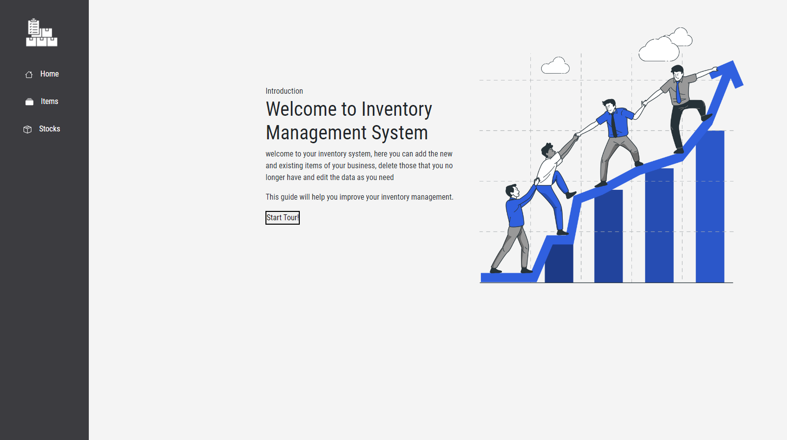

# inventory-management
CRUD, based on inventory management.

## Installation

npm install
## How to run

npm start

## Features

* Basic inventory management adds, edits and removes.
* Responsive web and design at multiple resolutions.
* Bootstrap deployments.

## Author

 

 [@stefanygonzalezleon](https://www.github.com/stefanygonzalezleon)

